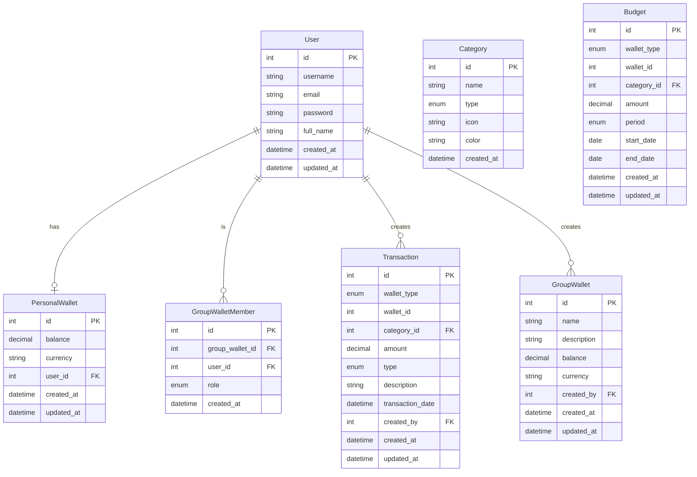

# Database UML Diagram

## Relationships

1. **User - PersonalWallet**: One-to-One
   - Mỗi user có một hũ chi tiêu cá nhân
   - Mỗi hũ chi tiêu cá nhân thuộc về một user

2. **User - GroupWallet**: One-to-Many
   - Một user có thể tạo nhiều quỹ chi tiêu chung
   - Mỗi quỹ chi tiêu chung được tạo bởi một user

3. **User - GroupWalletMember**: One-to-Many
   - Một user có thể là thành viên của nhiều quỹ chi tiêu chung
   - Mỗi thành viên trong quỹ chi tiêu chung là một user

4. **GroupWallet - GroupWalletMember**: One-to-Many
   - Một quỹ chi tiêu chung có nhiều thành viên
   - Mỗi thành viên thuộc về một quỹ chi tiêu chung

5. **User - Transaction**: One-to-Many
   - Một user có thể tạo nhiều giao dịch
   - Mỗi giao dịch được tạo bởi một user

6. **Category - Transaction**: One-to-Many
   - Một danh mục có thể có nhiều giao dịch
   - Mỗi giao dịch thuộc về một danh mục

7. **Category - Budget**: One-to-Many
   - Một danh mục có thể có nhiều ngân sách
   - Mỗi ngân sách thuộc về một danh mục

## Enums

1. **GroupWalletRole**
   - OWNER: Chủ quỹ
   - MEMBER: Thành viên

2. **TransactionType**
   - INCOME: Thu nhập
   - EXPENSE: Chi tiêu

3. **WalletType**
   - PERSONAL: Hũ chi tiêu cá nhân
   - GROUP: Quỹ chi tiêu chung

4. **BudgetPeriod**
   - DAILY: Hàng ngày
   - WEEKLY: Hàng tuần
   - MONTHLY: Hàng tháng 